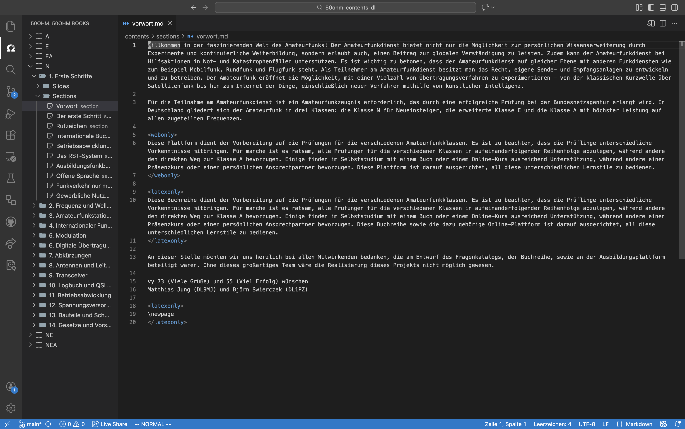

# 50ohm VSCode-Plugin


This plugin will assist content authors in structuring the [contents](https://github.com/DARC-e-V/50ohm-contents-dl) of the Website [50ohm.de](https://50ohm.de). 

## Installation:

This extension is distributed as a **VSIX package** via GitHub Releases.

### Install via VS Code GUI (recommended)

1. Download the latest `.vsix` file from the [GitHub Releases page](https://github.com/DARC-e-V/50ohm-vscode/releases/).
2. Open **Visual Studio Code**.
3. Go to **Extensions** (`Ctrl+Shift+X` / `Cmd+Shift+X`).
4. Click the **⋯** menu → **Install from VSIX…**.
5. Select the downloaded `.vsix` file and reload VS Code if prompted.

After installation, a **50ohm** icon appears in the Activity Bar.

---

### Install via Command Line

```bash
code --install-extension 50ohm-vscode-<version>.vsix
```

## Build VSIX manually:

Initial: 

```
npm install -g @vscode/vsce
```

Build VSIX:

```
vsce package
```
